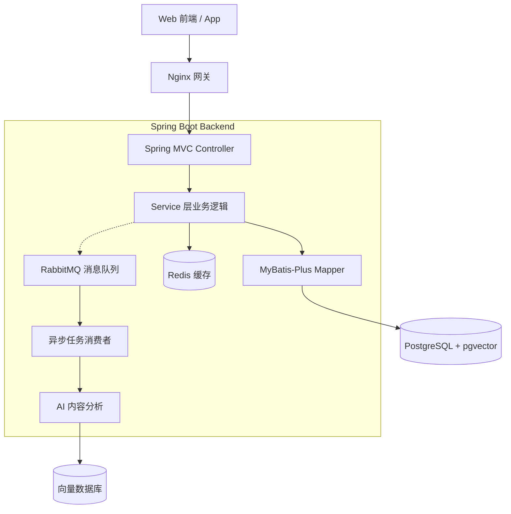

# 📺 ViewX — 智能视频平台

> 一个现代化、轻量级的视频分享平台，支持视频发布、AI 内容理解、个性化推荐、语义搜索和社交互动。
> 
> 后端基于 **Spring Boot 3 + Spring Security + PostgreSQL + Redis + RabbitMQ** 构建，强调清晰架构、流畅交互和智能推荐。

---

## 🚀 项目亮点

### 🔐 完善的用户认证系统
- JWT Token 认证 + Redis 黑名单机制
- 邮箱注册登录 + 验证码验证
- OAuth2 第三方登录（GitHub）
- 角色权限控制（RBAC）
- 用户资料管理 + 头像上传

### 🧠 AI 内容理解
- 视频摘要自动生成
- 自动提取标签（Tags）
- 向量化内容 embedding（基于 pgvector）
- 语义搜索支持

### 💬 社交互动体系
- 点赞、收藏、评论（支持树形结构）
- Redis 高性能计数系统
- 异步行为日志（RabbitMQ）
- 通知中心（评论通知、点赞通知）

### 🧱 清晰的架构设计
- Controller / Service / DAO / DTO / VO 分层规范
- PostgreSQL + MyBatis-Plus
- Redis + RabbitMQ 异步解耦
- 统一异常处理和结果封装
- 软删除支持

---

## 🏗️ 系统架构



---

## ⚙️ 核心功能模块

### 1. 🔐 用户系统（已完成 90%）
- ✅ 邮箱 + 密码注册登录
- ✅ JWT 鉴权 + Token 黑名单
- ✅ OAuth2（GitHub 登录）
- ✅ 用户资料修改
- ✅ 头像上传（本地存储）
- ✅ 角色权限控制

### 2. 📹 视频系统（开发中 60%）
- ✅ 视频数据模型设计
- ✅ 视频 DTO/VO 定义
- 🚧 视频上传接口
- 🚧 FFmpeg 转码
- 🚧 HLS 视频播放

### 3. 💬 社交互动（已完成 85%）
- ✅ 点赞、收藏（Redis 计数器）
- ✅ 评论系统（数据模型）
- ✅ 异步行为日志
- ✅ 通知系统

### 4. 🧠 AI + 推荐系统（开发中 40%）
- ✅ AI 服务接入（Spring AI + DashScope）
- ✅ 向量数据库（pgvector）
- ✅ 内容摘要生成
- ✅ 自动标签提取
- ✅ 语义搜索
- 🚧 个性化推荐算法

---

## 🗄️ 技术栈

| 层级 | 技术栈 |
|------|--------|
| 后端框架 | Spring Boot 3.4.x, Spring MVC |
| 安全 | Spring Security 6, JWT, OAuth2 |
| 数据库 | PostgreSQL 16 + pgvector |
| ORM | MyBatis-Plus 3.5.x |
| 缓存 | Redis 7.x |
| 消息队列 | RabbitMQ 3.x |
| AI | Spring AI + DashScope (Qwen-Max) |
| 前端 | Vue 3 + Element Plus + Tailwind CSS |
| 文档 | Swagger 3 (SpringDoc) |
| 部署 | Docker, Docker Compose |

---

## 📚 项目目录结构

```
ViewX/
├── src/main/java/com/flowbrain/viewx/
│   ├── config/          # 配置类（Security, Redis, Swagger, MyBatis）
│   ├── controller/      # 控制器层
│   ├── service/         # 业务逻辑层
│   │   └── impl/        # 服务实现
│   ├── dao/             # MyBatis-Plus Mapper
│   ├── pojo/
│   │   ├── entity/      # 数据库实体
│   │   ├── dto/         # 数据传输对象（入参）
│   │   └── vo/          # 视图对象（出参）
│   ├── common/          # 全局常量、枚举、统一返回
│   ├── util/            # 工具类（JwtUtils, RedisUtils）
│   └── exception/       # 全局异常处理
├── src/main/resources/
│   ├── application.yml  # 主配置文件
│   ├── application-dev.yml
│   ├── application-prod.yml
│   └── sql/             # 数据库初始化脚本
├── ViewX-frontend/      # Vue 3 前端项目
└── docs/                # 项目文档
```

---

## 🚀 快速开始

### 前置要求
- JDK 17+
- Maven 3.8+
- PostgreSQL 15+
- Redis 7+
- RabbitMQ 3.x
- Node.js 18+ (前端)

### 1. 克隆项目
```bash
git clone https://github.com/wangxiansenya15/ViewX.git
cd ViewX
```

### 2. 启动依赖服务
```bash
# 使用 Docker Compose 启动 PostgreSQL, Redis, RabbitMQ
docker-compose up -d
```

### 3. 配置数据库
```bash
# 执行 SQL 初始化脚本
psql -U postgres -d viewx_db -f src/main/resources/sql/users.sql
psql -U postgres -d viewx_db -f src/main/resources/sql/videos.sql
# ... 其他 SQL 文件
```

### 4. 配置环境变量
编辑 `src/main/resources/application-dev.yml`，配置：
- 数据库连接
- Redis 连接
- AI API Key
- JWT Secret

### 5. 启动后端
```bash
mvn spring-boot:run
```

### 6. 启动前端
```bash
cd ViewX-frontend
npm install
npm run dev
```

访问 http://localhost:5173

---

## � API 文档

启动后端后，访问 Swagger UI：
```
http://localhost:8080/swagger-ui/index.html
```

---

## 📅 开发路线图

| 阶段           | 状态 | 主要内容 |
|--------------|------|----------|
| **v0.0.1**   | ✅ 已完成 | 用户系统、基础架构、AI 接入、Redis/MQ |
| **v0.12.2**  | ✅ 已完成 | 视频上传、转码、HLS 播放 |
| **v0.12.20-dev** | ✅ 已完成 | 基础功能完整闭环（聊天、通知、安全修复、人机验证） |
| **v1.0.0**   | 📅 计划中 | 推荐系统（协同过滤 + 内容推荐）、性能优化 |
| **v1.0.1**   | 📅 计划中 | 前后端联调、部署上线 |

详细路线图请查看 [Project_Roadmap.md](docs/Project_Roadmap.md)

---

## 🛠️ 开发文档

- [系统架构概览](docs/System_Architecture_Overview.md)
- [VO/DTO/Entity 最佳实践](docs/VO_DTO_Entity_Best_Practices.md)
- [数据层架构](docs/Data_Layer_Architecture.md)
- [开发踩坑记录](docs/Development_Pitfalls.md)
- [AI 集成指南](docs/AI_Integration_Guide.md)
- [Cursor Rules 配置说明](docs/Cursor-Rules-配置说明.md) - **使用 Cursor Antigravity等AI IDE必读**
- [人机验证实现总结](docs/人机验证实现总结.md)
- [人机验证快速参考](docs/人机验证-快速参考.md)

---

## 🤝 贡献指南

欢迎贡献代码！请遵循以下步骤：

1. Fork 本仓库
2. 创建特性分支 (`git checkout -b feature/AmazingFeature`)
3. 提交更改 (`git commit -m 'Add some AmazingFeature'`)
4. 推送到分支 (`git push origin feature/AmazingFeature`)
5. 提交 Pull Request

---

## 📝 许可证

本项目采用 MIT 许可证 - 详见 [LICENSE](LICENSE) 文件

---

## ❤️ 致谢

本项目受到 Bilibili、YouTube、Tiktok的启发。

感谢以下开源项目：
- Spring Boot / Spring Security
- PostgreSQL / pgvector
- MyBatis-Plus
- Redis / RabbitMQ
- Vue.js / Element Plus

---

## 📧 联系方式

- 作者：Arthur Wang
- Email: arthurwang202511@gmail.com
- GitHub: [@Arthur Wang](https://github.com/wangxiansenya15)

---

**⭐ 如果这个项目对你有帮助，请给个 Star！**
