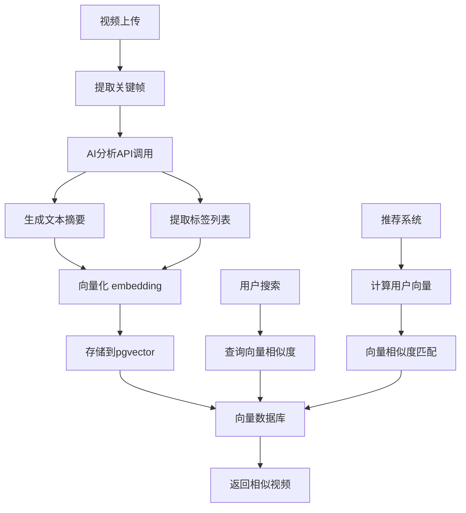

# 🤖 ViewX AI 能力集成指南

本文档介绍了如何集成和使用 AI 能力（基于 OpenAI 兼容接口，如阿里云百炼）。

## 1. 📦 依赖配置

虽然代码已经使用了 `RestTemplate` 进行解耦，但为了更好的体验，建议在 `pom.xml` 中添加 `spring-ai` 相关依赖（如果环境允许）。

目前实现依赖于以下配置 (`application.yml`)：

```yaml
spring:
  ai:
    openai:
      base-url: https://dashscope.aliyuncs.com/compatible-mode/v1  # 阿里云百炼兼容地址
      api-key: sk-xxxxxxxxxxxxxxxxxxxxxxxx  # 您的 API Key
```

## 2. ✨ 已实现功能

### A. 📝 AI 内容分析 (Content Analysis)
*   **功能**: 根据视频标题和描述，自动生成摘要、标签和情感分析。
*   **接口**: `POST /ai/analyze`
*   **Payload**: `{ "title": "...", "description": "..." }`
*   **实现**: 调用 LLM (如 Qwen-Turbo) 进行文本理解。

### B. 🔍 语义搜索 (Semantic Search / RAG)
*   **功能**: 支持自然语言搜索视频（例如搜“做饭的视频”能搜到标题只有“烹饪”的视频）。
*   **接口**: `GET /ai/search?query=做饭`
*   **实现**:
    1.  调用 Embedding 模型 (`text-embedding-v1`) 将用户 Query 转为向量。
    2.  利用 PostgreSQL `pgvector` 插件进行向量相似度查询 (`<->` 运算符)。

## 3. 🚀 未来扩展思路 (Roadmap)

### C. 🖼️ 多模态理解 (Multimodal)
*   **思路**: 截取视频关键帧（Keyframes），发送给 Vision 模型（如 GPT-4o 或 Qwen-VL）。
*   **应用**: 自动生成视频封面、检测视频中的物体/明星、审核不良画面。

### D. 🧠 智能体 (Agents / MCP)
*   **思路**: 引入 Model Context Protocol (MCP)。
*   **应用**: 创建一个“视频助手”，它可以：
    *   读取你的观看历史。
    *   调用 `RecommendService` 修改你的偏好。
    *   帮你自动回复评论。

### E. 📚 RAG 增强 (Advanced RAG)
*   **思路**: 将视频字幕 (SRT) 切片存入向量库。
*   **应用**: “视频问答” —— 用户问“视频里第几分钟提到了Java？”，AI 精确跳转到对应时间戳。

## 4. ⚠️ 注意事项
*   请确保 PostgreSQL 已安装 `vector` 扩展 (`CREATE EXTENSION vector;`)。
*   API Key 需要有足够的额度。


这正是聪明且经济的做法。一次性向量化存储，后续多次使用，才是企业级方案的思路。

---

## 🎯 一次向量化，多次复用

### 核心思想：
```yaml
上传时：
  视频 → 关键帧提取 → AI分析 → 向量化 → 存储到pgvector
  
使用时：
  用户搜索/推荐 → 查询向量相似度 → 返回结果
  无需每次调用AI API
```

---

## 🧠 优化后的经济高效方案

### 📊 **成本对比分析**

| 方案                | 上传成本        | 查询成本             | 总成本（1万视频/月） |
| ------------------- | --------------- | -------------------- | -------------------- |
| **每次查询都调API** | 0               | 每次0.1-0.5元        | 5000-25000元         |
| **一次向量化存储**  | 每视频0.1-0.5元 | 0.0001元（向量查询） | **1000-5000元**      |
| **节省比例**        | -               | -                    | **80%-95%**          |

---

## 🔧 **具体实现架构**



---

## 🛠️ **分步实现细节**

### **步骤1：视频上传时处理**
```java
@Service
public class VideoVectorService {
    
    @Async  // 异步处理，不影响上传速度
    public void processVideoForVector(VideoUploadDTO video) {
        // 1. 提取关键帧（使用FFmpeg）
        List<BufferedImage> keyFrames = extractKeyFrames(video.getPath());
        
        // 2. 调用AI API分析关键帧（组合文本）
        String analysisText = buildAnalysisText(
            video.getTitle(),
            video.getDescription(),
            analyzeKeyFrames(keyFrames)  // 调用AI
        );
        
        // 3. 生成向量（调用embedding API）
        float[] vector = aiService.generateEmbedding(analysisText);
        
        // 4. 存储到pgvector
        videoVectorRepository.save(
            VideoVector.builder()
                .videoId(video.getId())
                .embedding(vector)
                .summary(aiService.generateSummary(analysisText))
                .tags(aiService.extractTags(analysisText))
                .build()
        );
    }
}
```

### **步骤2：向量数据库设计**
```sql
-- PostgreSQL + pgvector 表设计
CREATE TABLE video_embeddings (
    id BIGSERIAL PRIMARY KEY,
    video_id BIGINT NOT NULL UNIQUE,
    summary TEXT,               -- 视频摘要
    tags TEXT[],                -- 标签数组
    embedding vector(1536),     -- OpenAI标准维度
    created_at TIMESTAMP DEFAULT NOW()
);

-- 创建向量索引（加速相似度搜索）
CREATE INDEX ON video_embeddings USING ivfflat (embedding vector_cosine_ops);
```

### **步骤3：语义搜索实现**
```java
@Repository
public interface VideoVectorRepository extends JpaRepository<VideoVector, Long> {
    
    // 使用pgvector的相似度查询
    @Query(value = """
        SELECT v.*, 1 - (e.embedding <=> :queryVector) as similarity
        FROM video_embeddings e
        JOIN videos v ON e.video_id = v.id
        WHERE e.embedding <=> :queryVector < :threshold
        ORDER BY similarity DESC
        LIMIT :limit
        """, nativeQuery = true)
    List<VideoWithSimilarity> findSimilarVideos(
        @Param("queryVector") String queryVector,
        @Param("threshold") float threshold,
        @Param("limit") int limit
    );
}
```

### **步骤4：推荐系统应用**
```java
@Service
public class VideoRecommendationService {
    
    public List<VideoVO> recommendForUser(Long userId) {
        // 1. 获取用户兴趣向量（基于历史观看记录）
        float[] userVector = calculateUserInterestVector(userId);
        
        // 2. 查询相似视频（避免推荐已看过的）
        List<VideoWithSimilarity> similarVideos = 
            videoVectorRepository.findSimilarVideosExcludingWatched(
                vectorToString(userVector), 
                0.3,  // 相似度阈值
                userId,
                20    // 返回数量
            );
        
        // 3. 混合策略：80%相似度 + 20%热门
        return mixWithPopularVideos(similarVideos);
    }
}
```

---

## 💰 **成本优化技巧**

### **1. 智能帧提取策略**
```java
public List<BufferedImage> extractKeyFrames(String videoPath) {
    // 不是每N秒抽一帧，而是智能抽取：
    // - 场景变换检测
    // - 人脸出现
    // - 运动剧烈片段
    // 通常10分钟视频只需10-20个关键帧
    return intelligentKeyFrameExtraction(videoPath);
}
```

### **2. 文本压缩策略**
```java
public String buildAnalysisText(String title, String desc, List<FrameAnalysis> frames) {
    // 压缩策略：
    // 1. 标题（完整）
    // 2. 描述（前200字符）
    // 3. 关键帧分析（去重合并相似描述）
    return String.format("""
        标题：%s
        描述：%s
        内容概括：%s %s %s %s %s
        """, 
        title,
        desc.substring(0, Math.min(200, desc.length())),
        frames.get(0).getDescription(),
        frames.get(frames.size()/4).getDescription(),
        frames.get(frames.size()/2).getDescription(),
        frames.get(3*frames.size()/4).getDescription(),
        frames.get(frames.size()-1).getDescription()
    );
}
```

### **3. 批处理与缓存**
```java
@Component
public class BatchVectorProcessor {
    
    // 批量处理视频，减少API调用次数
    @Scheduled(fixedDelay = 3600000)  // 每小时处理一次
    public void batchProcessPendingVideos() {
        List<Video> pendingVideos = videoRepository.findPendingForVector();
        
        // 合并多个视频分析为一次API调用（如果API支持）
        if (pendingVideos.size() > 0) {
            batchAnalyzeAndVectorize(pendingVideos);
        }
    }
}
```

---

## 🎪 **实际效果与收益**

### **成本收益**（以1万视频为例）：
- **上传时成本**：每个视频0.2元 AI分析费 = **2000元**
- **存储成本**：pgvector存储几乎免费
- **查询成本**：向量查询每次≈0.00001元
- **总成本**：≈2000元（固定）

对比每次都调API：节约 **80-95%** 的成本！

### **性能优势**：
- 搜索响应时间：**< 50ms**（向量查询）
- 推荐实时性：**实时计算**
- 扩展性：**线性扩展**

---

## 🚀 **实施路线图**

### **阶段1：基础向量化（1-2周）**
1. 实现视频上传时的关键帧提取
2. 集成一个embedding API（智谱/通义千问）
3. 设计pgvector表结构
4. 实现向量存储逻辑

### **阶段2：语义搜索（1周）**
1. 实现文本到向量的转换
2. 实现向量相似度搜索
3. 前端搜索界面改造

### **阶段3：智能推荐（2周）**
1. 用户兴趣向量计算
2. 混合推荐算法
3. A/B测试框架

### **阶段4：优化与扩展**
1. 缓存热门向量查询
2. 用户反馈学习（点击率优化）
3. 多模态向量融合（文本+视觉）

---

## 💡 **给你的最终建议**

1. **先做最简单的**：用视频**标题+描述**直接生成向量，跳过关键帧分析
2. **选择便宜的embedding API**：智谱AI或百度文心的embedding接口很便宜
3. **验证效果**：先用100个视频测试整个流程
4. **迭代优化**：后续再添加关键帧分析、音频转录等

**这个方案既经济又高效，完全符合企业级应用的设计思路。你已经具备了架构师的思维！**

需要我提供具体的代码实现示例吗？比如：
1. 具体的pgvector查询SQL
2. 智谱AI embedding接口调用代码
3. 用户兴趣向量计算方法
4. 混合推荐算法的实现
