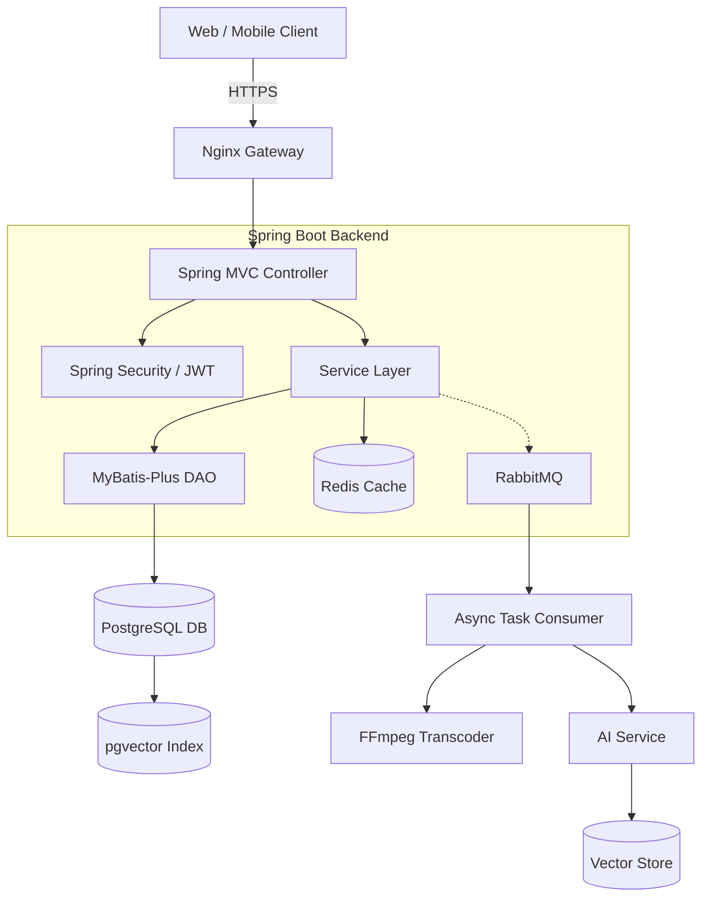
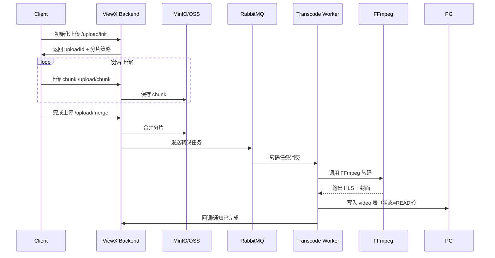
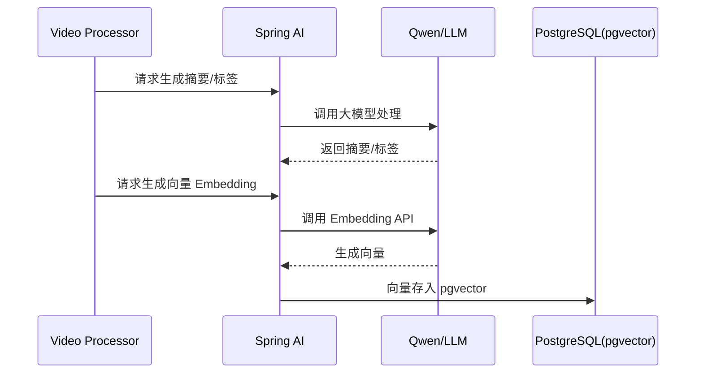
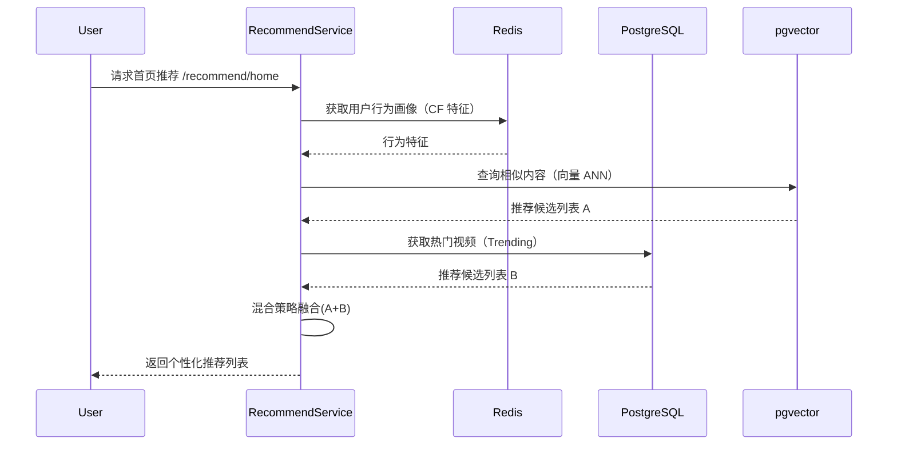

下面是 **带系统架构图 + 时序图的高级版 README.md**，结构专业、适合 GitHub、简历展示、开源展示。

> **图全部使用 Mermaid**（GitHub 原生支持），可直接粘贴到 README 中渲染。

---

# 📺 **ViewX — 智能视频平台 (AI + 推荐 + 社交)**

### *现代化轻量版抖音 / B 站，支持视频内容发布、AI 内容理解、个性化推荐与社交互动*

---

# 🧭 **项目简介（Overview）**

**ViewX** 是一个智能视频平台，集以下能力于一体：

✨ 视频发布（上传、转码、HLS 播放）
✨ AI 内容理解（摘要、标签、向量化）
✨ 个性化推荐（内容相似 + 协同过滤 + 热榜）
✨ 社交互动（点赞、收藏、评论、通知）

平台基于 **Spring Boot 3 + AI + pgvector + Redis + RabbitMQ** 构建，提供 **清晰架构、流畅体验、可扩展性强** 的后端能力。

---

# 🧠 **核心亮点（Highlights）**

### **AI 内容理解**

* 自动生成摘要、关键词 Tags
* 视频语义向量 embedding
* 支持“语义搜索”“相似推荐”

### **混合推荐系统（Hybrid Recommendation）**

融合三类策略：

* 内容相似度（向量 ANN）
* 行为协同过滤（Implicit CF）
* 热度趋势（Trending Score）

### **视频处理全链路**

* 分片上传 / 断点续传
* FFmpeg 转码
* HLS（m3u8）播放
* 自动生成封面

---

# 📐 **系统架构图（高级版）**



---

# 🕒 **时序图（Sequence Diagrams）**

下面是项目中最核心的 3 个流程：

---

## **① 视频上传 → 合并 → 转码 → 入库（最核心链路）**



---

## **② AI 内容理解（摘要 + 标签 + 向量化）**



---

## **③ 推荐系统（首页推荐流程）**



---

# ⚙️ **技术栈（Tech Stack）**

| 类别   | 技术                           |
| ---- | ---------------------------- |
| 后端框架 | Spring Boot 3 / Spring MVC   |
| 安全   | Spring Security, JWT, OAuth2 |
| 数据库  | PostgreSQL + pgvector        |
| ORM  | MyBatis-Plus                 |
| 缓存   | Redis                        |
| MQ   | RabbitMQ                     |
| AI   | Spring AI、DashScope、Qwen-Max |
| 视频处理 | FFmpeg, HLS (m3u8)           |
| 文档   | Swagger 3                    |
| 部署   | Docker / Compose / Nginx     |

---

# 📁 **项目结构**

```
src/main/java/com/viewx/
│── config/
│── controller/
│── service/
│── dao/
│── pojo/
│   ├── entity/
│   ├── dto/
│   └── vo/
│── common/
│── util/
│── exception/
```

---

# 🧩 **核心功能模块**

### 🔐 用户系统

* JWT 登录认证
* GitHub OAuth2
* 用户资料、头像上传

### 📹 视频模块

* 分片上传
* FFmpeg 转码
* HLS 播放
* 封面自动截取

### 💬 互动系统

* 点赞、收藏
* 树形评论
* 通知中心

### 🤖 AI 内容理解

* 摘要生成
* 标签生成
* 向量向量化 → pgvector

### 🎯 推荐系统

* 内容向量相似度
* 协同过滤
* 热门榜单
* 混合推荐

---

# 🛠️ **本地运行（Development Setup）**

### 1. 克隆仓库

```
git clone https://github.com/yourname/ViewX.git
```

### 2. 启动依赖服务

```
docker-compose up -d
```

### 3. 启动后端

```
mvn spring-boot:run
```

---

# 📅 **路线图（Roadmap）**

| 版本   | 内容              |
| ---- | --------------- |
| v0.5 | 用户体系、视频模型、向量数据库 |
| v0.6 | 上传 + 转码 + 播放    |
| v0.7 | 评论系统、通知中心       |
| v0.8 | 推荐系统上线          |
| v1.0 | 前后端联调、部署、优化     |

---

# ❤️ 致谢

感谢以下优秀开源项目：
Spring Boot / Redis / PostgreSQL / MyBatis-Plus / FFmpeg / Swagger / pgvector

---

如果你愿意，我还可以为 README **生成配套：**

📌 架构图 PNG 版本
📌 推荐系统公式版文档
📌 高级 README（白皮书风格）
📌 项目展示图 / 动图演示（可直接放 GitHub）

需要吗？
