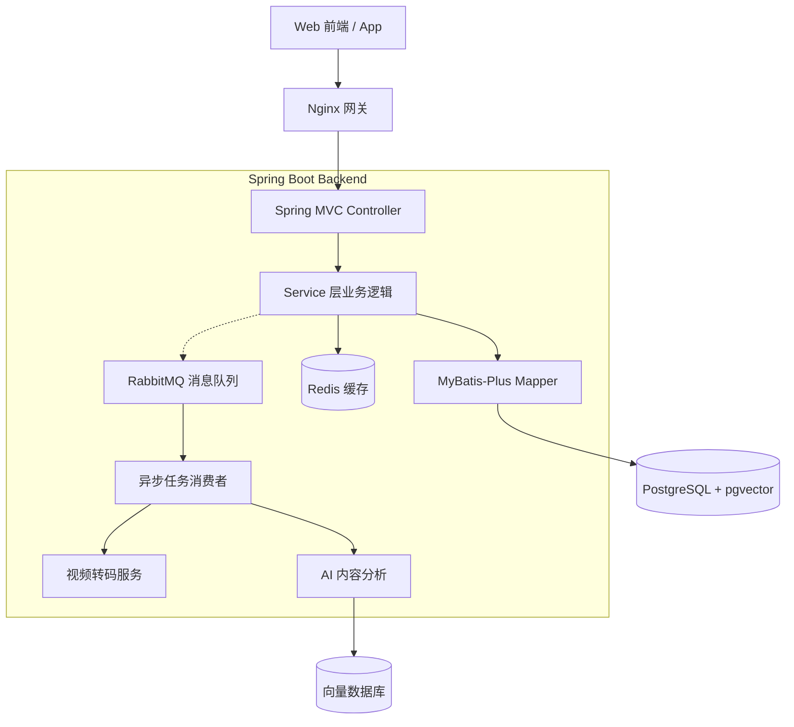

下面是一份 **专业、招聘友好、结构清晰的 README.md**，你可以直接复制粘贴到 GitHub 仓库。
内容包含：项目简介、核心功能、技术栈、系统架构图、推荐系统、AI 能力、运行方式、路线图等。

---

# **📺 ViewX — 智能视频平台（智能推荐 / AI 内容理解 / 社交互动）**

> 一个现代化、轻量级的抖音/B 站式视频平台。
> 支持 **视频发布、AI 内容理解、个性化推荐、语义搜索、社交互动**。
> 后端基于 **Spring Boot 3 + AI 模型 + pgvector + Redis + RabbitMQ** 构建，强调 **清晰架构 + 流畅交互 + 智能推荐**。

---

## 🚀 **项目亮点（Project Highlights）**

### 🧠 **AI 内容理解**

* 视频摘要自动生成
* 自动提取标签（Tags）
* 向量化内容 embedding → 用于语义搜索 & 相似推荐

---

### 🎯 **个性化推荐系统**

综合三类推荐策略：

1. **内容相似度推荐（向量相似度）**
2. **行为协同过滤（Like / 收藏 / 浏览）**
3. **热门推荐（Trending）**

多策略融合，构成 **混合推荐系统（Hybrid Recommendation）**。

---

### 📹 **视频处理完整链路**

* 分片上传 / 断点续传
* 上传 → MQ → FFmpeg 转码
* 生成 HLS（m3u8）流媒体
* 自动截取封面

---

### 💬 **社交互动体系**

* 点赞、收藏、评论（支持树形结构）
* Redis 高性能计数系统
* 异步行为日志
* 通知中心（评论通知、点赞通知）

---

### 🧱 **架构清晰、可扩展**

* Controller / Service / DAO / DTO / VO 分层规范
* PostgreSQL + MyBatis-Plus
* Redis + RabbitMQ 异步解耦
* AI 与向量数据库（pgvector）深度集成

---

# 🏗️ **系统架构（System Architecture）**



---

# ⚙️ **核心功能模块**

## 1. 🔐 用户系统

* 邮箱 + 密码注册登录
* JWT 鉴权
* OAuth2（GitHub 登录）
* 用户资料修改、头像上传

---

## 2. 📹 视频系统（核心）

* 视频分片上传 / 断点续传
* 文件存储 MinIO / OSS
* FFmpeg 转码
* HLS (m3u8) 视频播放
* 自动封面截取
* 视频标签 / 描述 / 分类

---

## 3. 💬 社交互动

* 点赞、收藏（Redis 计数器）
* 评论（嵌套树结构）
* 通知系统

---

## 4. 🧠 AI + 推荐系统

### 内容理解（Content Intelligence）

* 自动生成视频摘要
* 自动生成标签（tags）
* 向量 embedding → 存入 pgvector

### 推荐系统（Recommendation Engine）

* 相似视频推荐（向量相似度）
* 协同过滤（基于用户行为）
* 热度推荐

---

# 🗄️ **技术栈（Tech Stack）**

| 层级   | 技术栈                            |
| ---- | ------------------------------ |
| 后端框架 | Spring Boot 3.4.x, Spring MVC  |
| 安全   | Spring Security 6, JWT, OAuth2 |
| 数据库  | PostgreSQL, pgvector           |
| ORM  | MyBatis-Plus                   |
| 缓存   | Redis                          |
| 消息队列 | RabbitMQ                       |
| AI   | Spring AI、DashScope/Qwen-Max   |
| 视频处理 | FFmpeg, HLS                    |
| 文档   | Swagger 3 (SpringDoc)          |
| 部署   | Docker, Docker Compose, Nginx  |

---

# 📚 **项目目录结构（Backend）**

```
src/main/java/com/viewx/
│── config/         # Security / Redis / Swagger / MyBatis 配置
│── controller/     # 控制器层
│── service/        # 业务逻辑层
│── dao/            # MyBatis-Plus Mapper
│── pojo/
│   ├── entity/     # 数据库实体
│   ├── dto/        # 入参对象
│   └── vo/         # 出参对象
│── common/         # 全局常量、统一返回 Result
│── util/           # 工具类 (JwtUtil, RedisUtil)
│── exception/      # 全局异常处理
```

---

# 🔥 **推荐系统设计（简述）**

### 1️⃣ 内容相似度推荐（主力）

使用向量数据库做 ANN 搜索：

```
SELECT * FROM video
ORDER BY embedding <-> :currentVideoEmbedding
LIMIT 20;
```

### 2️⃣ 行为协同过滤（CF）

数据来源：

* 浏览日志
* 点赞
* 收藏

生成用户相似度 & 视频偏好矩阵。

### 3️⃣ 热门推荐（Trending）

根据：

* 播放量
* 点赞增长率
* 收藏增长率
  构建热度榜。

最终组合成：

**Hybrid = w1 * 内容相似 + w2 * 协同过滤 + w3 * 热度**

---

# 🚀 安装运行（Run Locally）

### **1. 克隆项目**

```
git clone https://github.com/your-name/ViewX.git
```

---

### **2. 启动依赖（Redis / PostgreSQL / MQ）**

项目根目录执行：

```
docker-compose up -d
```

---

### **3. 启动 Spring Boot 后端**

```
mvn spring-boot:run
```

---

# 📅 路线图（Roadmap）

| 阶段   | 内容                       |
| ---- | ------------------------ |
| v0.5 | 用户系统、视频模型、基础 AI、Redis/MQ |
| v0.6 | 视频上传 + 转码 + HLS 播放       |
| v0.7 | 评论树结构、通知系统               |
| v0.8 | 推荐系统（内容 + 协同过滤）          |
| v1.0 | 前后端联调、部署上线               |

---

# ❤️ 致谢

本项目受到 Bilibili、YouTube、抖音 的启发。
感谢 Spring Boot / Redis / PostgreSQL / MyBatis-Plus 等优秀开源项目。

---

如果你需要，我可以帮你继续生成：

✅ **英文版 README.md**
✅ **带项目动图（GIF）的 README**
✅ **前端工程 README**
✅ **加上架构图 / 时序图的 README 高级版**

需要哪一版？
