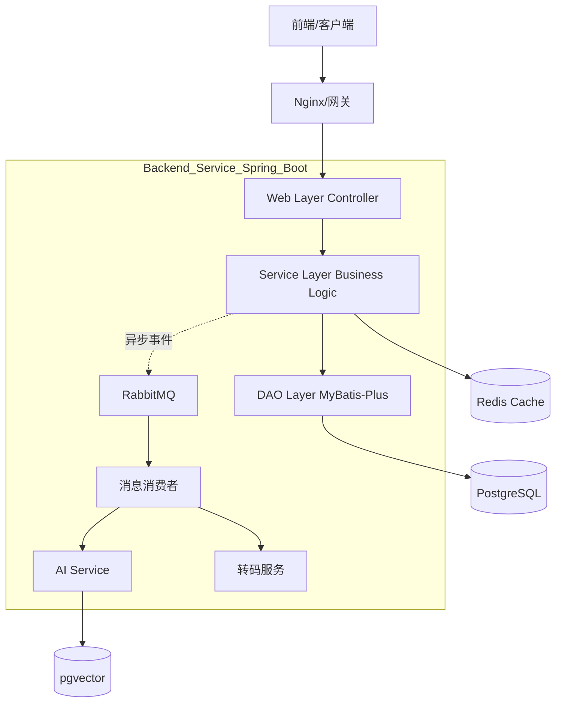

# 🏗️ ViewX 系统架构概览 (System Architecture Overview)

本文档旨在为开发团队提供 ViewX 后端系统的全景视图，涵盖技术栈、系统架构、核心功能模块及目录结构说明。

## 1. 📝 项目简介 (Introduction)

ViewX 是一个现代化的视频分享平台，致力于提供流畅的视频观看体验和丰富的社区交互功能。后端采用 Spring Boot 3.4.5 构建，集成了 AI 内容分析、实时消息推送、OAuth2 社交登录等先进特性。

## 2. 🛠️ 技术栈 (Technology Stack)

### 核心框架
*   **Spring Boot 3.4.5**: 核心应用框架。
*   **Spring Security 6.x**: 安全认证与授权（JWT + OAuth2）。
*   **Spring MVC**: Web 层 MVC 框架。

### 数据存储
*   **PostgreSQL**: 主关系型数据库，用于存储用户、视频、评论等核心数据。
*   **pgvector**: PostgreSQL 向量插件，用于存储 AI 生成的向量数据（语义搜索）。
*   **Redis**: 缓存中间件，用于存储 Token、热点数据、计数器（点赞/播放量）。

### ORM 框架
*   **MyBatis-Plus**: 增强版 MyBatis，提供 CRUD 接口、自动填充、逻辑删除、分页插件等功能。

### 消息队列
*   **RabbitMQ**: 异步消息处理，用于视频转码通知、AI 分析任务、用户行为日志解耦。

### AI & 智能化
*   **Spring AI**: 统一 AI 接入层。
*   **DashScope (阿里云)**: 提供大模型服务（Qwen-Max），用于视频内容理解、标签生成。

### 工具库
*   **Lombok**: 简化 Java 代码（Getter/Setter/Builder）。
*   **Hutool**: Java 工具包（加密、日期、JSON 等）。
*   **SpringDoc (Swagger 3)**: API 文档自动生成。

## 3. 📐 系统架构 (System Architecture)

ViewX 采用经典的分层架构，并结合了事件驱动的异步处理机制。

### 关键流程
1.  **同步业务**: 用户请求 -> Controller -> Service -> DB/Redis -> 返回结果。
2.  **异步业务**: Service -> 发送消息到 RabbitMQ -> 消费者处理 (如：视频上传后的转码、AI 分析)。
3.  **AI 增强**: 视频入库 -> AI 分析内容 -> 生成向量 -> 存入 pgvector -> 支持语义搜索。

## 4. 🧩 核心功能模块 (Core Features)

### 4.1 用户系统 (User System)
*   **认证**: 支持邮箱/密码登录，集成 GitHub OAuth2 社交登录。
*   **鉴权**: 基于 JWT 的无状态认证，配合 RBAC (Role-Based Access Control) 权限控制。
*   **管理**: 用户资料修改、头像上传、密码重置（邮件验证码）。

### 4.2 视频核心 (Video Core)
*   **元数据**: 视频标题、简介、标签、分类。
*   **存储**: 支持对象存储（MinIO/OSS）和本地存储。
*   **处理**: 异步转码流程，生成多码率视频流（HLS/DASH）。
*   **软删除**: 全局启用逻辑删除 (`is_deleted`)，保障数据安全。

### 4.3 社交交互 (Interaction)
*   **互动**: 点赞、收藏、分享。
*   **评论**: 支持多级嵌套评论（树形结构）。
*   **计数**: 使用 Redis HyperLogLog 或计数器实现高性能计数。

### 4.4 通知系统 (Notification)
*   **类型**: 系统通知、点赞通知、评论通知。
*   **推送**: 结合 WebSocket 实现实时推送（规划中），目前支持轮询/列表查询。

### 4.5 AI 模块 (AI Module)
*   **内容理解**: 自动生成视频摘要、提取关键词。
*   **智能推荐**: 基于向量相似度的内容推荐。

## 5. 📂 目录结构说明 (Directory Structure)

`src/main/java/com/flowbrain/viewx/`

*   **`config/`**: 全局配置类 (Security, Redis, Swagger, MyBatis 等)。
*   **`controller/`**: Web 层控制器，处理 HTTP 请求。
*   **`service/`**: 业务逻辑层。
*   **`dao/`**: 数据访问层 (Mapper 接口)。
*   **`pojo/`**:
    *   **`entity/`**: 数据库实体类 (对应 DB 表)。
    *   **`dto/`**: 数据传输对象 (接收前端参数)。
    *   **`vo/`**: 视图对象 (返回前端数据)。
*   **`common/`**: 通用常量、枚举、结果封装类 (`Result`).
*   **`util/`**: 工具类 (JwtUtils, RedisUtils 等)。
*   **`exception/`**: 全局异常处理。

## 6. 🚀 开发规范 (Development Standards)

*   **API 风格**: RESTful API。
*   **响应格式**: 统一使用 `Result<T>` 包装。
*   **异常处理**: 使用 `@RestControllerAdvice` 全局捕获异常。
*   **代码风格**: 遵循阿里巴巴 Java 开发手册。
