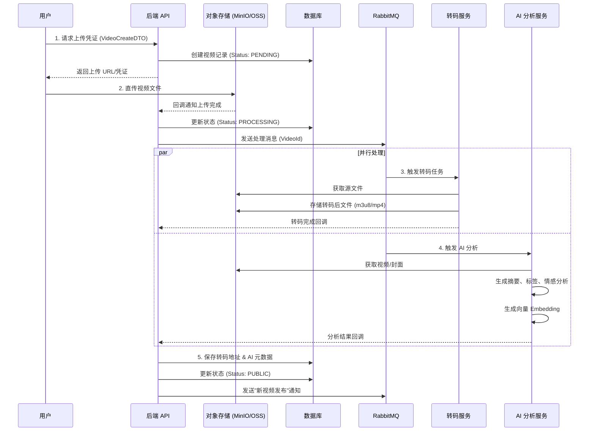
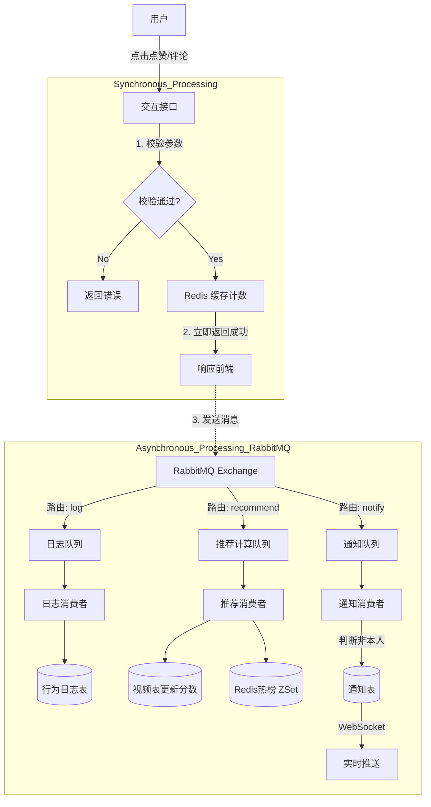
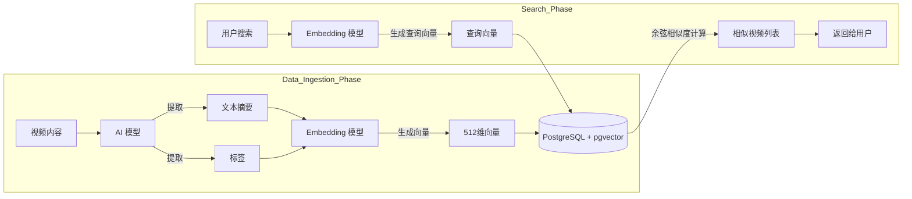
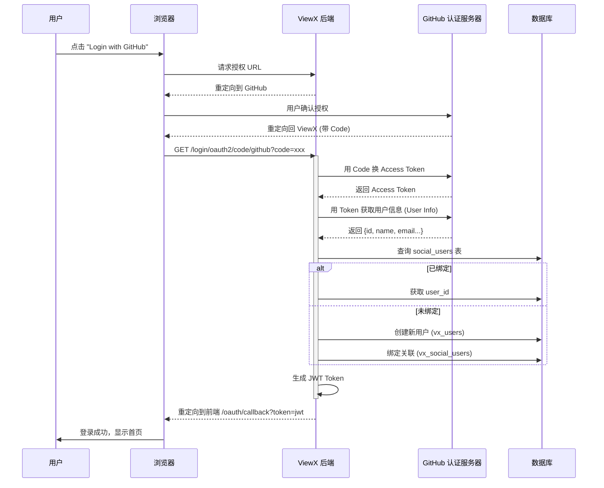

# 🔄 ViewX 系统业务流程图 (System Flowcharts)

本文档使用 Mermaid 语法展示 ViewX 核心业务的流程逻辑。

## 1. 📹 视频上传与处理流程 (Video Upload & Processing)

展示视频从用户上传到最终发布的完整生命周期，包括转码和 AI 分析。

## 2. ❤️ 用户交互与异步通知 (Interaction & Notification)

展示点赞、评论等操作如何通过 MQ 实现削峰填谷和异步通知。

## 3. 🧠 AI 分析与语义搜索 (AI Analysis & Semantic Search)

展示如何利用向量数据库实现语义搜索。

## 4. 🔐 OAuth2 第三方登录流程 (OAuth2 Login)

